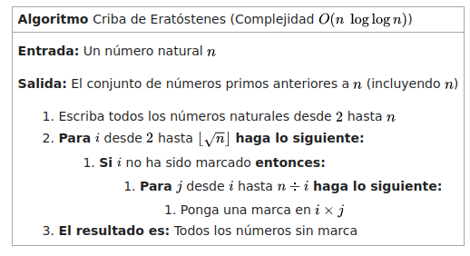

El algoritmo base utilizado fue **Criba de Eratóstenes** (*Sieve of Eratosthenes*).

https://es.wikipedia.org/wiki/Criba_de_Erat%C3%B3stenes

Se le incorpora la modificación que mejora su eficiencia (también mencionada en el artículo) donde los múltiplos comienzan a iterarse desde el cuadrado del número original.

