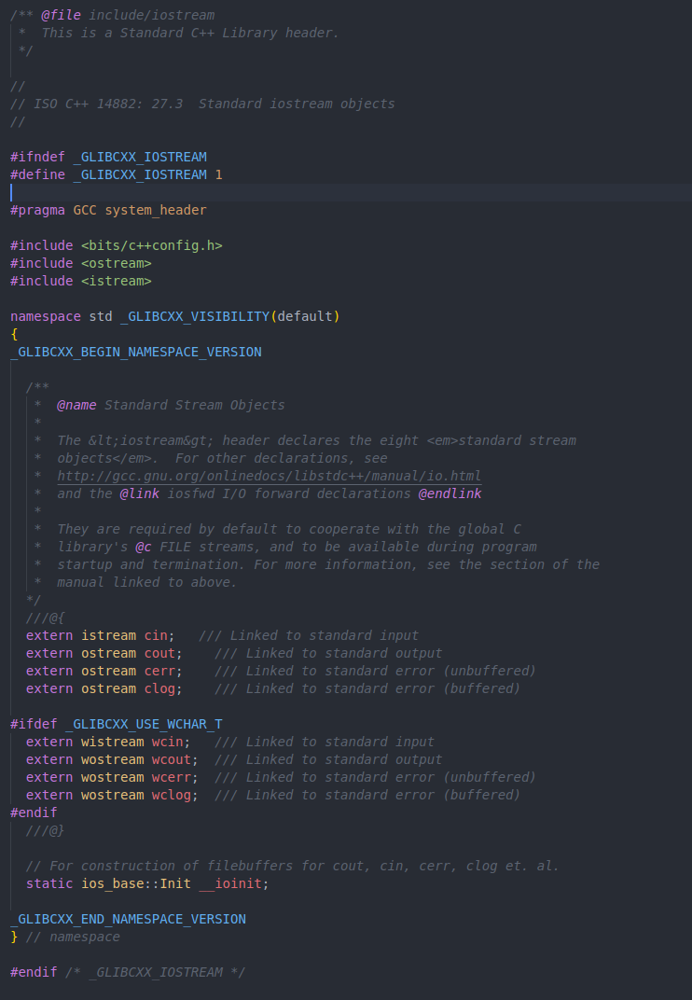
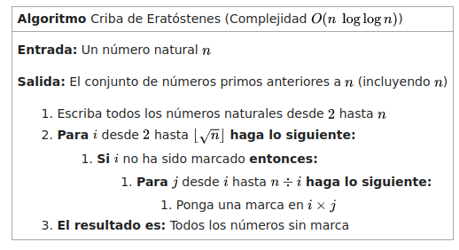

# Trabajo Práctico 1

## Parte 1

La librería `<iostream>` se encuentra en el directorio `/usr/include/c++/11/` junto a demás librerías del lenguaje como `<fstream>` o `<vector>`.

Contiene las definiciones de librerías como `<istream>` y `<ostream>` (que se encuentran en el mmismo directorio), entre otras, que contienen los inputs (`cin`) y outputs básicos (`cout`, `cerr`, `clog`)

## Parte 2

El algoritmo base utilizado fue **Criba de Eratóstenes** (*Sieve of Eratosthenes*).

https://es.wikipedia.org/wiki/Criba_de_Erat%C3%B3stenes

Se le incorpora la modificación que mejora su eficiencia (también mencionada en el artículo) donde los múltiplos comienzan a iterarse desde el cuadrado del número original.

